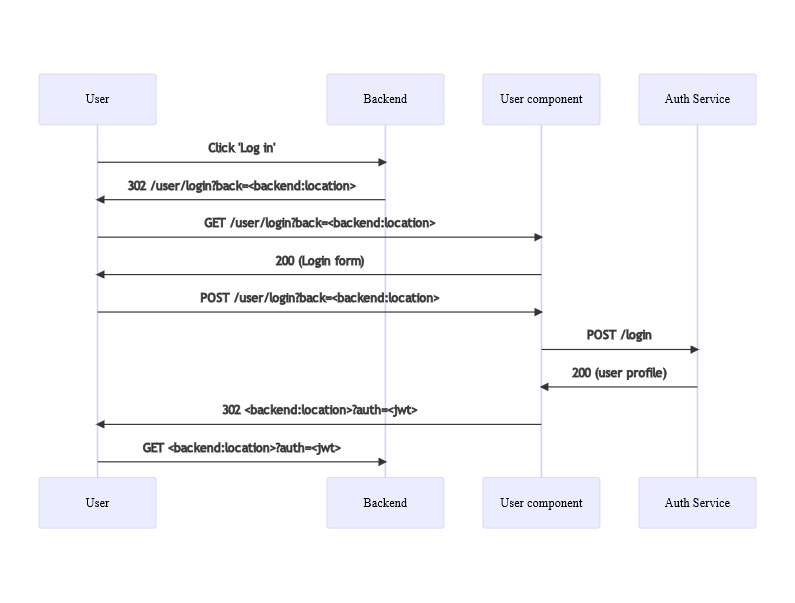
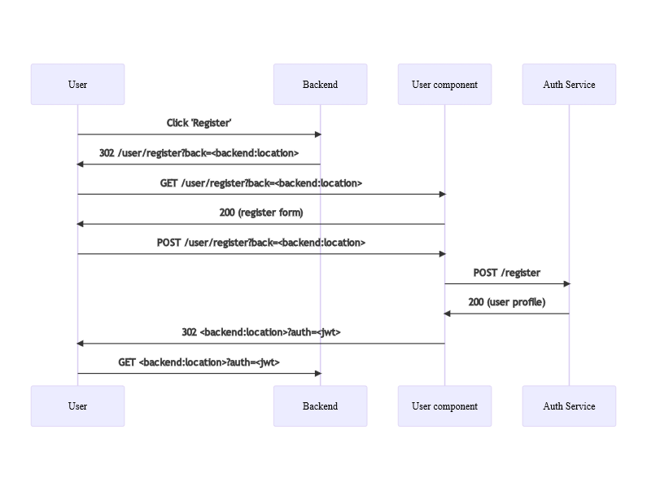

This document describes the mechanisms used for user creation and
authentication.
This document provides a solution for identifying a user using an external
service for identity management.

User account management is not in the scope of this document.
This document consumes an external service for user management, as described
in the application diagram titled 'Use Case' version '18-OCT-2021' provided by
_Nicolas Glassey_.

## Related work

Discussions of user creation management not delegating to an external service
are outside the scope of this document due to handout requirements.

Delegation of user identity management is a useful technique for reducing the
security responsibilities around user credentials for both users and services
seeking to mutually identify themselves. [^1][delegation-1] [^2][delegation-2]
By delegating credentials management, service providers alleviate the amount of
credentials stored by the user, thus alleviating risky credential management
(such as password reuse).
Moreover, service providers reduce the attack surface of data breaches and limit
their impact on the user security.

[delegation-1]: https://mytechblogs.medium.com/identity-delegation-and-federated-authentication-e900689bf8ca
[delegation-2]: https://docs.microsoft.com/en-us/windows-server/identity/ad-fs/design/when-to-use-identity-delegation

It is common practice to use OAuth 2.0 [^1][oauth-1] to have the user authorize
services to access data of the user stored in a resource server [^2][oauth-2].
In OAuth 2.0, a service requests the user to authenticate to an authentication
server and authorize a set of 'scopes' to the service; the authentication
server provides a token to the user that for them to relay to the service,
the service then uses this token to access elements in the resource server as
allowed in the scope authorized by the user.
In our case, the web application can request access to the user identity stored
resource server.
Implementing this kind of workflow does require careful security planning
[^3][oauth-3], but it is usually preferred due to its intrinsic consideration
of data sovereignty concerns [^4][oauth-4].

[oauth-1]: https://oauth.net/2/
[oauth-2]: https://www.clowder.com/post/why-your-organization-should-be-using-oauth-2.0
[oauth-3]: https://medium.com/securing/what-is-going-on-with-oauth-2-0-and-why-you-should-not-use-it-for-authentication-5f47597b2611
[oauth-4]: https://archive.fosdem.org/2020/schedule/event/dip_decentralizing_oauth/

While our use-case would be covered by OAuth 2.0, the infrastructure workload
(given the provided services) does not justify the current requirements.

## Detailed design

A separate web application hosting the pages for user creation and login.
This will run as a separate web application from the main backend without
database nor FS access.
The token provided by the upstream auth service will be relayed to the backend
through the user as illustrated in the reference use-cases section.

Running a separate web application (WAR) for user management has the following
benefits:

- Reduced horizontal security attack surface [^1][design-1]:
  The application server runs each WAR in an isolated classloader, thus
  compromising the classloader of one WAR does not propagate to the other.
  An attacker would still require VM escape + local privilege escalation to
  read or modify another application code.

- Decoupled deployment:
  WARs can be developed and deployed independently.

- Availability:
  The indisponibility of an application does not affect any other, users may
  continue to use the backend even if the login functionnality is unavailable.

- Microservices-oriented:
  The separate web application can be develop with other design objective in
  mind (such as security) than the main application.
  Moreover, it can be easily replaced or modified in the future since it is
  designed with a clear interface from the beginning.

[design-1]: https://docs.wildfly.org/18/Developer_Guide.html

This proposal is not opinionated about monorepos or multirepos.
For an initial implementation we could use the same repo and have a separate
[maven modules][maven-modules] for each application.

[maven-modules]: https://maven.apache.org/guides/mini/guide-multiple-modules.html

## Reference use-cases

### A user logs in

### A visitor creates an account

## Alternatives

### Embrace the monolith

Extend the 'backend' application to add the user-related views to the same web
application context.

Disadvantages:

- Risk of parasitic dependencies to other components of the web application
  (citation needed).
- Adding an orthogonal concern to the 'backend' application.
- Tightly coupled deployments.

Advantages:

- Easy to simply add additional views to the existing frontend.
- No need to modify deployment to include a new web application.

### Handover to the view

Extend the 'backend' application to add simple 'proxy' endpoints that sanitize
and provide access to the auth service and have the view call such endpoints.

Disadvantages:

- Adding business logic to the frontend.
- Through frontend testing (such as selenium) becomes a requirement.
  The business logic in the frontend MUST be tested.

Advantages:

- Smaller footprint in the 'backend' application wrt adding specific views.

## Future work

- Replacing both this component and the auth service with an OAuth 2.0
  provider.

If we have an external OAuth 2.0 provider, we could just reuse the abundant
resources for OAuth 2.0 integration in web applications.
