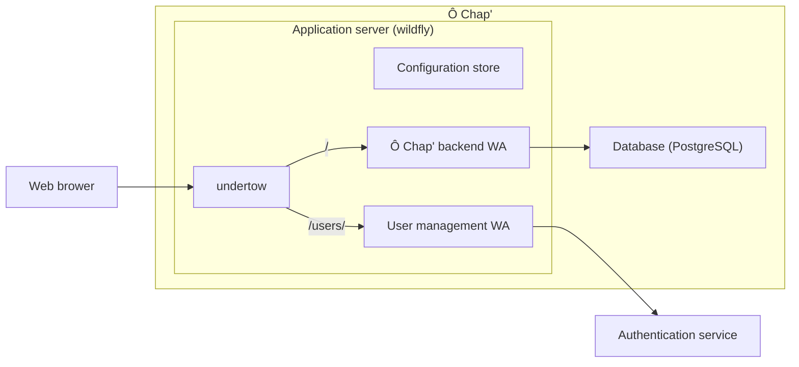

# Web application components

```mermaid
graph LR
  subgraph ochap["Ô Chap'"]
    subgraph appserver["Application server (wildfly)"]
      undertow
      appconfig["Configuration store"]
      backend["Ô Chap' backend WA"]
      usermgmt["User management WA"]
    end

    database["Database (PostgreSQL)"]

    undertow -->|/| backend
    undertow -->|/users/| usermgmt

    backend --> database
  end

  authservice["Authentication service"]
  usermgmt --> authservice

  client["Web brower"]
  client --> undertow
```
