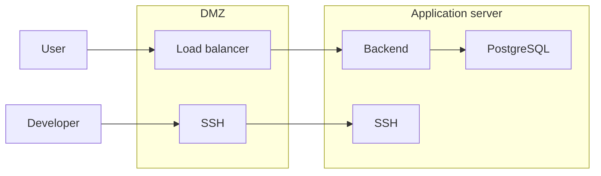

# Infrastructure overview

## Production environment

### Component overview

```mermaid
flowchart LR
    subgraph DMZ
    LB["Load balancer"]
    SSH-dmz["SSH"]
    end

    subgraph APP["Application server"]
    Backend
    SSH-app["SSH"]
    Backend --> PostgreSQL
    end

    LB --> Backend
    SSH-dmz --> SSH-app

    User --> LB
    Developer --> SSH-dmz
```
