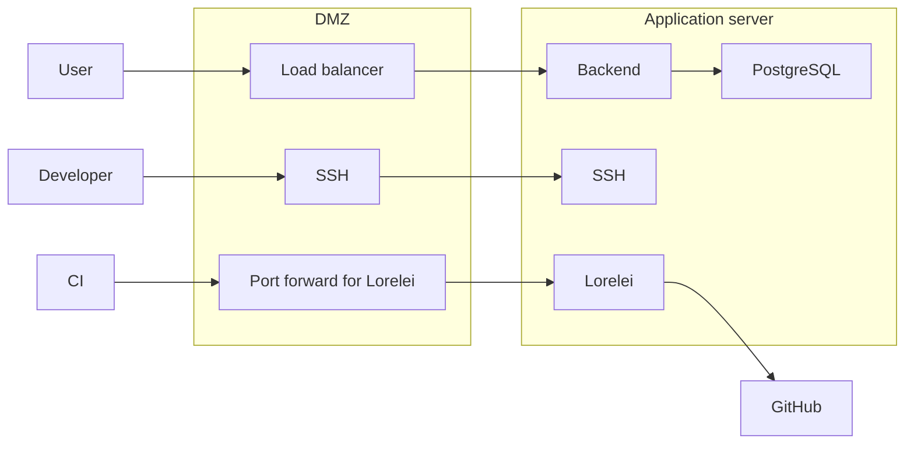
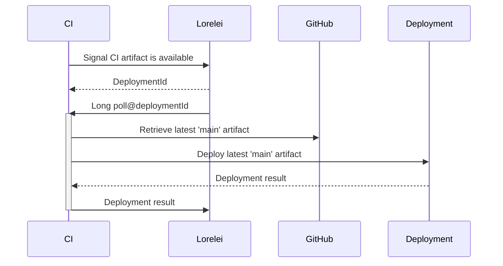

# Infrastructure overview

## Production environment

### Component overview

## Automated deployments

Some components may be automatically deployed from CI artifacts on master.
This allows for continuous delivery without an infrastructure intervention.

### Lorelei

Since our software forge is outside our trustred network, a mechanism for
detecting changes and proactively performing a deployment is required.

In order to reach the application server, developers need to proxy jump through
the bastion in the DMZ using SSH.
This exposes both the bastion in the DMZ and the application server to arbitrary
code execution, in the case of developer access, this is desirable, but in the
case of an automated system, this is unnecessary and can only increase the
attack surface.

Lorelei is a small and simple HTTP daemon.
The CI can **signal** Lorelei a new CI artifact is available for a given
component, this signal contains no additional information.
Lorelei will then query GitHub for the latest CI on the 'main' branch, download
its artifacts and proceed to deployment.
The CI can query the state of the current deployment and wait until the
deployment is completed.

The following sequence diagram exemplifies the usual use-case.

#### Requirements

- Development of an aditional software component (though it should be minimal).
- Port-forwarding an extra port on the DMZ.

#### Security considerations

- Lorelei listens on HTTP. An attacker may intercept a request to Lorelei from
  within the GitHub CI runner infrastructure and prevent a deployment from being
  performed.

- The Lorelei API is public. An attacker may use this to trigger unintended
  deployments.
  Since the attacker does not have control on what version may be deployed nor
  the latest CI artifact, no side-effects will be performed by Lorelei on the
  application server, but may result in Lorelei getting rate-limited by GitHub
  and thus potentially causing a denial-of-service.

- The Lorelei implementation increases the attack surface to a potential
  framework/language vulnerability.
  We estimate the Lorelei API is simple enough to be trivially auditable.

#### Alternatives

The issue of automated deployments is a requirement which should still be
addressed, bellow are some other implementation ideas:

- Provide SSH keys to the CI and authorize them on the DMZ and Application
  server.
  This would increase the attack surface since anybody with push access may leak
  and gain unrestricted access to our infrastructure.
  Malicious contributions introducing malicious code in open-source projects is
  a latent threat (see examples [on the Linux kernel][vuln-lk],
  [crypto wallets][vuln-wallet]).

[vuln-lk]: https://heimdalsecurity.com/blog/university-of-minnesota-banned-by-linux-for-malicious-code/
[vuln-wallet]: https://www.theregister.com/2019/06/07/komodo_npm_wallets/

- Have the application self-update through a webhook (or CI signal).
  This would unnecessarily complexify the application code, violate software
  engineering principles of separation of concerns and clutter the codebase with
  unnecessarily complicated tests.

#### Future work

Lorelei could be extended to rollback a deployment if such deployment fails to
start.
