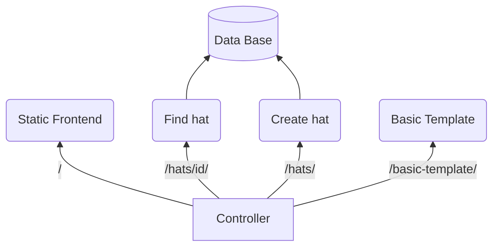
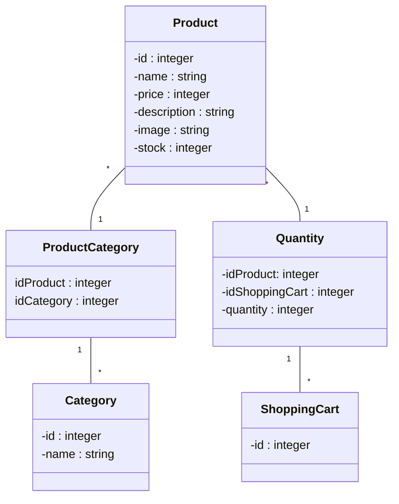

# Diagram
### Application architecture

```mermaid
flowchart BT
    Controller -->|/| sf(Static Frontend)
    Controller -->|/hats/id/| fh(Find hat)
    Controller -->|/hats/| ch(Create hat)
    Controller -->|/basic-template/| bt(Basic Template)
    fh --> DB[(Data Base)] 
    ch --> DB
```

### Database model

```mermaid
classDiagram
    class Product {
        -id : integer
        -name : string
        -price : integer
        -description : string
        -image : string
        -stock : integer
    }
    class ProductCategory {
        idProduct : integer
        idCategory : integer
    }
    class Category {
        -id : integer
        -name : string
    }
    class Quantity {
        -idProduct: integer
        -idShoppingCart : integer
        -quantity : integer
    }
    class ShoppingCart {
        -id : integer
    }
    Product "*" -- "1" ProductCategory
    ProductCategory "1" -- "*" Category
    Product "*" -- "1" Quantity
    Quantity "1" -- "*" ShoppingCart
```